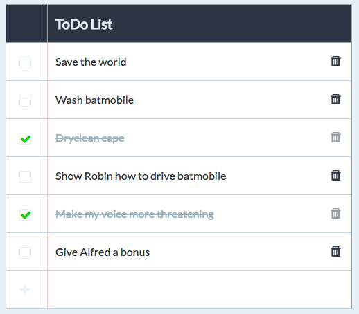

# ToDo App

The application displays a list of tasks to be performed. Tasks are divided into done and to-do. Done tasks are crossed out, colored and the checkbox on the left is marked. To-do tasks have an unchecked checkbox on the left.

The row with the possibility of adding a new task is always displayed under the task list. A new task is always a to-do task.

A row with the option of adding a new task is always at the very bottom of the list.

You can't add a task without entering the title.

Each task can be deleted by clicking on the trash can icon.

## Demo

[ToDo App - Live DEMO](https://karoczerwinska.github.io/ToDo_App/)

## Technologies used in this project

- HTML
- CSS
- JavaScript

## Preview

